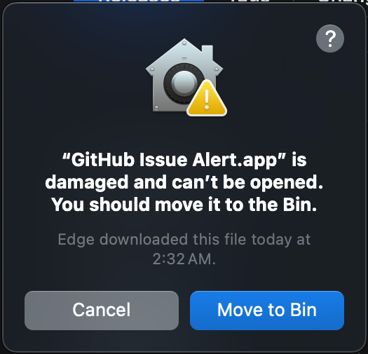

# GitHub Issue Alert

A lightweight desktop app that polls any GitHub repository for new issues and sends instant desktop notifications when they are created.

Built using **Electron** and **React**.

---

## 🖥 macOS Installation Guide

> ⚠️ This app has only been tested on macOS. It is currently **unsigned and not notarized**, so additional steps are required to run it.

### Steps

1. Download the latest release from the [Releases page](https://github.com/ashuvssut/github-issue-alert/releases/latest) and extract it to your desired location.

2. Move the `GitHub Issue Alert.app` to your `Applications` folder.

3. If you try to open the app, you may see the error:

    > "GitHub Issue Alert is damaged and can't be opened."
    >
    > 


   To fix this, run the following command in your terminal:

   ```bash
   sudo xattr -rd com.apple.quarantine "/Applications/GitHub Issue Alert.app"
   ```

4. If the app opens but fails to send notification alerts, run the following command to sign it locally:

   ```bash
   sudo codesign --deep --force --sign - "/Applications/GitHub Issue Alert.app"
   ```

Once these steps are completed, the app should function normally and send GitHub issue alerts as expected.


